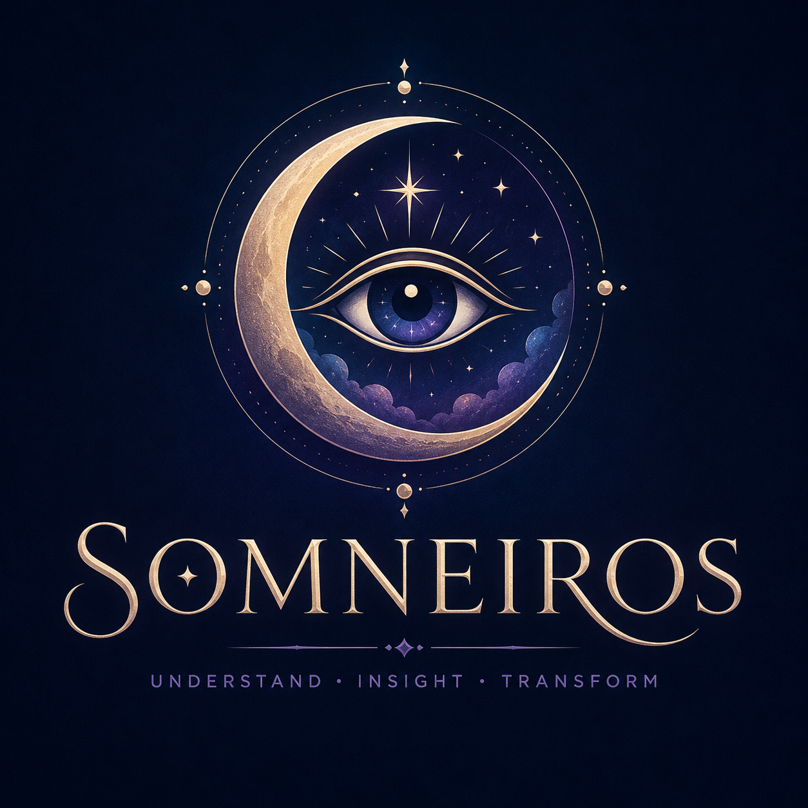

<p align="center">
  
</p>

# Somneiros

**Understand • Insight • Transform**

Somneiros is a privacy-conscious progressive web app for recording dreams, exploring recurring patterns, and generating reflective interpretations.

## Try the app live

### [https://davidfliesen.github.io/somneiros](https://davidfliesen.github.io/somneiros)

## Current features

- Responsive single-page PWA
- Installable on supported desktop and mobile browsers
- Offline application shell
- Local dream journal stored in the browser
- JSON journal export
- Starter dream-symbol explorer
- Rule-based reflective interpretation prototype
- Dark and light modes
- Colab-ready agentic research notebook for expanding the Dream Interpretation Database

## Project structure

```text
somneiros/
├── index.html
├── styles.css
├── app.js
├── manifest.webmanifest
├── sw.js
├── assets/
│   ├── somneiros-logo.png
│   ├── icon-192.png
│   ├── icon-512.png
│   ├── apple-touch-icon.png
│   └── favicon.png
├── data/
│   └── did_seed.json
└── notebooks/
    └── Somneiros_DID_Agentic_Research.ipynb
```

## Run locally

Because service workers require HTTP or HTTPS, run the project through a local web server rather than opening `index.html` directly.

```bash
python -m http.server 8000
```

Then open `http://localhost:8000`.

## Publish with GitHub Pages

1. Create a GitHub repository named `somneiros`.
2. Upload these files to the repository root.
3. Open **Settings → Pages**.
4. Under **Build and deployment**, select **Deploy from a branch**.
5. Choose the `main` branch and `/root`.
6. Save.

The project is configured for:

[https://davidfliesen.github.io/somneiros](https://davidfliesen.github.io/somneiros)

## Dream Interpretation Database

The DID is intended to store multiple interpretations rather than one universal definition. Each record can include:

- Symbol and aliases
- Psychological themes
- Cultural or historical tradition
- Interpretation summary
- Supporting source
- Source type and date
- Confidence level
- Safety notes
- Contradictions and alternative readings

The included Colab notebook creates a research workflow with specialized agents for source discovery, evidence extraction, cultural-context review, psychological review, safety review, synthesis, deduplication, and export.

## Important limitations

Somneiros should not present dream interpretations as factual predictions, diagnoses, recovered memories, or evidence of supernatural certainty. Interpretations should be framed as possibilities and reflection prompts.

## Development roadmap

- Replace the starter rules with a DID-backed retrieval system
- Add recurring-theme analytics
- Add optional encrypted sync
- Add user-controlled AI interpretation
- Add citations and source cards
- Add dream tagging and calendar views
- Add image-assisted dream recall
- Package for iOS and Android after PWA validation

## License

Choose a license before public release. MIT is suitable for an open-source application, while the logo and brand assets may be retained under separate branding terms.
